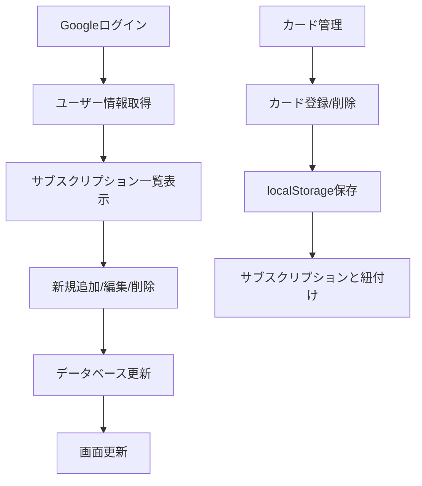

# 📱 サブスクリプション管理アプリ 使用説明書

> 支払いの見える化で家計を賢く管理

## 🌟 アプリの概要

このアプリは、Netflix、Spotify、Adobe Creative Cloud など、増え続けるサブスクリプションサービスの支払いを一元管理するためのツールです。月額料金の把握、支払日の管理、使用していないサービスの発見など、家計管理を効率化できます。

### 主な機能

| 機能                      | 説明                                                                               |
| ------------------------- | ---------------------------------------------------------------------------------- |
| 💰 **月額料金の見える化** | 年払いサービスも月額換算で表示し、実際の月間支出が一目で分かります                 |
| 📅 **支払日管理**         | 次回支払日を自動計算し、家計管理をサポートします                                   |
| 💳 **カード情報管理**     | 複数のクレジットカードを登録し、どのサービスがどのカードから引き落とされるかを管理 |
| 🔗 **直接アクセス**       | 各サービスの管理ページに直接アクセス可能                                           |

## 🚀 はじめに

### 1. ログイン

1. トップページの `Googleでログイン` ボタンをクリック
2. Google アカウントでサインインしてください

> 💡 **ポイント：** 初回ログイン時に自動的にユーザー情報がデータベースに登録されます。

## 💳 カード管理

### カードの登録手順

1. メイン画面の `カード管理` ボタンをクリック
2. `+ 新しいカードを追加` ボタンをクリック
3. 以下の情報を入力：

| 項目               | 説明                                                          | 例                             |
| ------------------ | ------------------------------------------------------------- | ------------------------------ |
| **カード名**       | 覚えやすい名前                                                | 「メインカード」「楽天カード」 |
| **カードブランド** | Visa、Mastercard、JCB、American Express、Diners Club から選択 | Visa                           |
| **末尾 4 桁**      | カード番号の最後の 4 桁                                       | 1234                           |
| **有効期限**       | 月と年を選択                                                  | 12/2027                        |

> ⚠️ **セキュリティ注意：** カード番号の全桁は保存されません。識別用に末尾 4 桁のみ記録されます。

### カードの削除

1. カード管理画面で削除したいカードの `削除` ボタンをクリック
2. 確認ダイアログで削除を確定

> ⚠️ **注意：** カードを削除すると、そのカードを使用しているサブスクリプションのカード設定もクリアされます。

## 📋 サブスクリプション管理

### 新しいサブスクリプションの追加

#### 1. サービス選択

メイン画面の `+ 新規追加` ボタンをクリックし、以下から選択：

- **人気サービス：** Netflix、Spotify、Adobe Creative Cloud 等の料金が自動入力
- **カスタムサービスを入力：** 手動で情報を入力

#### 2. 詳細情報の入力

| 項目               | 必須 | 説明                                 |
| ------------------ | ---- | ------------------------------------ |
| **サービス名**     | ✅   | 管理用の名前                         |
| **料金**           | ✅   | 実際の支払金額（円）                 |
| **支払日**         | ✅   | 毎月の引き落とし日（1-31 日）        |
| **支払いサイクル** | ✅   | 月払い、四半期払い、半年払い、年払い |
| **更新月**         | ❌   | 年払いなどの場合の開始月             |
| **支払いカード**   | ❌   | 登録済みカードから選択               |
| **管理 URL**       | ❌   | サービスの管理ページ URL             |

> 💡 **便利機能：** 人気サービスを選択すると、料金・サイクル・URL が自動入力されますが、編集可能です。

### サブスクリプションの編集・削除

1. サブスクリプション一覧で `編集` または `削除` ボタンをクリック
2. 編集画面で情報を変更し、「保存」をクリック
3. ON/OFF ボタンでサービスの有効/無効を切り替え可能

## 📊 メイン画面の見方

### 画面上部

- **ユーザー名表示：** ログイン中の Google アカウント名
- **月相当額合計：** アクティブなサブスクリプションの月額換算合計
- **操作ボタン：** カード管理、新規追加、ログアウト

### サブスクリプション一覧表

| 列名                  | 説明                                                |
| --------------------- | --------------------------------------------------- |
| **サービス名**        | 登録したサービスの名前                              |
| **月相当額/実支払額** | 月額換算額（年払いの場合は「月換算額/実際の年額」） |
| **サイクル**          | 支払い頻度（月払い、年払いなど）                    |
| **支払日**            | 毎月の引き落とし日                                  |
| **次回支払日**        | 次回の支払予定日（OFF の場合は「-」）               |
| **支払いカード**      | 使用するクレジットカード                            |
| **管理 URL**          | サービスの管理ページリンク                          |
| **操作**              | 編集・削除ボタン                                    |
| **状態**              | ON（アクティブ）/OFF（非アクティブ）                |

### 行の色分け

- 🟢 **緑色の行：** アクティブなサブスクリプション
- 🔴 **赤色の行：** 非アクティブなサブスクリプション

## ⚙️ 高度な機能

### 支払いサイクルの計算

| サイクル       | 頻度        | 次回支払日の計算    |
| -------------- | ----------- | ------------------- |
| **月払い**     | 毎月        | 翌月の同日          |
| **四半期払い** | 3 ヶ月ごと  | 開始月から 3 ヶ月後 |
| **半年払い**   | 6 ヶ月ごと  | 開始月から 6 ヶ月後 |
| **年払い**     | 12 ヶ月ごと | 開始月から 1 年後   |

### 月相当額の計算方法

```
月相当額 = 実支払額 ÷ 支払いサイクル月数
```

**例：**

- Adobe Creative Cloud 年額 ¥87,360 ÷ 12 ヶ月 = ¥7,280/月
- Netflix 月額 ¥1,590 ÷ 1 ヶ月 = ¥1,590/月

## 🎯 よくある使用例

### 毎月の支出を把握したい

1. すべてのサブスクリプションを登録
2. 画面上部の「月相当額合計」で総支出を確認
3. 使っていないサービスは OFF に切り替えて支出削減

### 支払日を整理したい

1. 「次回支払日」列で今後の支払いスケジュールを確認
2. 支払日が集中している場合は、サービスの支払日設定を変更
3. 給料日後に支払いを集中させるなどの調整

### カードの使い分け管理

1. 複数のクレジットカードを登録
2. 各サービスに適切なカードを設定
3. 「支払いカード」列でどのカードから引き落とされるかを一目で確認

## 🔧 技術仕様

### 対応環境

- **ブラウザ：** Chrome、Firefox、Safari、Edge（最新版推奨）
- **デバイス：** PC、タブレット、スマートフォン対応
- **認証：** Google アカウント必須

### 使用技術

- **フロントエンド：** Next.js 14, React, TypeScript, Tailwind CSS
- **認証：** NextAuth.js (Google Provider)
- **データベース：** Prisma ORM
- **状態管理：** React Hooks

### データ管理

- **データベース：** Prisma を使用したデータ永続化
- **セキュリティ：** カード情報は末尾 4 桁のみ保存
- **バックアップ：** クラウドデータベースに自動保存

## 📝 プリセットサービス一覧

### 動画配信サービス 🎬

| サービス                     | 月額料金 | 年額オプション |
| ---------------------------- | -------- | -------------- |
| Netflix 広告つきスタンダード | ¥890     | -              |
| Netflix スタンダード         | ¥1,590   | -              |
| Netflix プレミアム           | ¥2,290   | -              |
| YouTube Premium 個人         | ¥1,280   | ¥12,800        |
| Amazon Prime                 | ¥600     | ¥5,900         |
| Disney+ スタンダード         | ¥990     | ¥9,900         |
| U-NEXT                       | ¥2,189   | -              |

### 音楽配信サービス 🎵

| サービス               | 月額料金 | 年額オプション |
| ---------------------- | -------- | -------------- |
| Spotify Premium 個人   | ¥980     | -              |
| Apple Music 個人       | ¥1,080   | ¥10,800        |
| Amazon Music Unlimited | ¥1,080   | -              |

### AI ツール 🤖

| サービス       | 月額料金 |
| -------------- | -------- |
| Claude Pro     | ¥2,900   |
| ChatGPT Plus   | ¥2,900   |
| GitHub Copilot | ¥1,200   |

### クリエイティブツール 🎨

| サービス                          | 月額料金 |
| --------------------------------- | -------- |
| Adobe Creative Cloud コンプリート | ¥7,280   |
| Adobe Photoshop                   | ¥2,680   |
| Figma Professional                | ¥1,800   |
| Canva Pro                         | ¥1,500   |

## ❓ よくある質問

### Q: カード情報は安全ですか？

**A:** 完全なカード番号は保存されません。識別用に末尾 4 桁、ブランド、有効期限のみが記録されます。

### Q: 年払いサービスの管理はどうなりますか？

**A:** 年払いサービスも月額換算で表示されるため、月間の実質支出が把握できます。次回支払日も正確に計算されます。

### Q: サービスを一時停止したい場合は？

**A:** 「状態」列の ON/OFF ボタンで切り替えできます。OFF にしても情報は保持され、月額合計からは除外されます。

### Q: 管理 URL は何に使いますか？

**A:** 各サービスの解約ページや設定ページの URL を登録しておくと、一覧から直接アクセスできて便利です。

### Q: データは他の人に見られませんか？

**A:** Google アカウントでログインした本人のデータのみ表示されます。他のユーザーのデータは一切見えません。

## 💡 活用のコツ

### 支出削減のヒント

- 月末に一覧を確認し、使っていないサービスを OFF に
- 似たようなサービス（音楽配信など）の重複をチェック
- 年払い割引があるサービスは年額プランを検討
- 学生割引があるサービスは適用可能かチェック

### 支払日管理のコツ

- 給料日後に支払日を集中させる
- 高額サービスは月の前半、小額サービスは後半に分散
- クレジットカードの締め日を考慮した設定

## 🔄 データフロー



## 📁 プロジェクト構成

```
├── app/
│   ├── api/auth/[...nextauth]/route.ts  # NextAuth設定
│   ├── layout.tsx                       # アプリレイアウト
│   └── page.tsx                         # メインページ
├── components/
│   ├── AddSubscriptionForm.tsx          # サブスク追加フォーム
│   ├── CardManagement.tsx               # カード管理画面
│   ├── EditModal.tsx                    # 編集モーダル
│   ├── LoginButton.tsx                  # ログインボタン
│   ├── SessionProvider.tsx              # セッションプロバイダー
│   └── SubscriptionList.tsx             # サブスク一覧
├── data/
│   ├── defaultSubscriptions.ts          # デフォルトデータ
│   └── popularServices.ts               # 人気サービスプリセット
├── lib/
│   ├── prisma.ts                        # Prisma設定
│   └── subscriptionService.ts           # データサービス
└── types/
    └── subscription.ts                  # 型定義
```

## 🛠️ 開発者向け情報

### 環境変数

以下の環境変数が必要です：

```env
NEXTAUTH_SECRET=your_secret_here
NEXTAUTH_URL=http://localhost:3000
GOOGLE_CLIENT_ID=your_google_client_id
GOOGLE_CLIENT_SECRET=your_google_client_secret
DATABASE_URL=your_database_url
```

### データベーススキーマ

#### User テーブル

```sql
- id: String (Primary Key)
- email: String (Unique)
- name: String (Optional)
- image: String (Optional)
- createdAt: DateTime
- updatedAt: DateTime
```

#### Subscription テーブル

```sql
- id: String (Primary Key)
- name: String
- description: String (Optional)
- price: Int
- paymentCycle: PaymentCycle
- paymentDay: Int
- startMonth: Int (Optional)
- category: String (Optional)
- url: String (Optional)
- isActive: Boolean
- userId: String (Foreign Key)
- cardId: String (Optional, Foreign Key)
- createdAt: DateTime
- updatedAt: DateTime
```

#### PaymentCard テーブル

```sql
- id: String (Primary Key)
- name: String
- brand: String
- lastFour: String
- expiryMonth: Int
- expiryYear: Int
- isDefault: Boolean
- userId: String (Foreign Key)
- createdAt: DateTime
- updatedAt: DateTime
```

### セットアップ手順

1. **依存関係のインストール**

   ```bash
   npm install
   ```

2. **データベースのセットアップ**

   ```bash
   npx prisma migrate dev
   ```

3. **開発サーバーの起動**
   ```bash
   npm run dev
   ```

## 🔒 セキュリティ機能

- **認証：** NextAuth.js による OAuth2.0 認証
- **カード情報保護：** 末尾 4 桁のみ保存、完全なカード番号は保存しない
- **ユーザー分離：** 各ユーザーは自分のデータのみアクセス可能
- **セッション管理：** 自動ログアウト機能

## 📱 レスポンシブデザイン

- **デスクトップ：** フル機能の表形式表示
- **タブレット：** 横スクロール対応
- **スマートフォン：** モバイル最適化された UI

## 🎉 今後の機能追加予定

- [ ] 支払い履歴の記録
- [ ] 支払い通知機能
- [ ] 年間支出レポート
- [ ] カテゴリ別支出分析
- [ ] 他の認証プロバイダー対応
- [ ] データエクスポート機能
- [ ] 家族アカウント共有機能

## 📞 サポート

技術的な問題や質問がある場合は、GitHub の Issues ページでお知らせください。

---

📱 **サブスクリプション管理アプリ v1.0**  
効率的な家計管理で、より良いサブスクライフを
